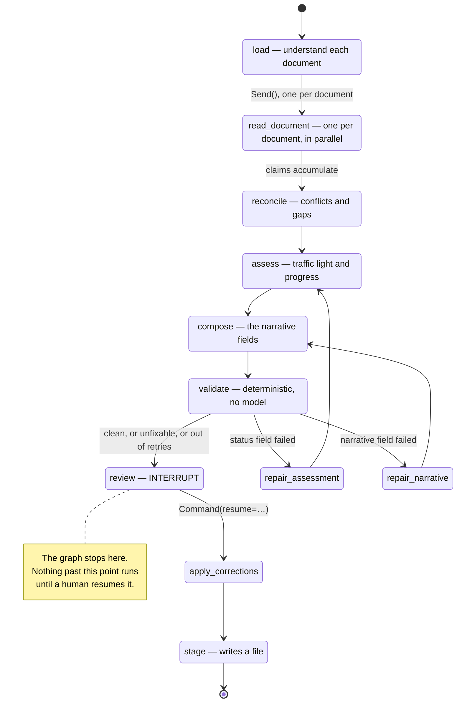
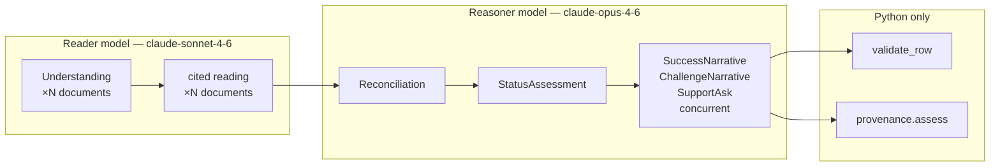

# How a draft gets made

A step-by-step trace of one run: which prompt fires, what is sent to the model,
what shape comes back, and what happens to it. Written against the code, not
from memory — file and line references are real.

Read alongside:

| File | What it holds |
| --- | --- |
| `app/graph/build.py` | The wiring, as a diagram in the docstring |
| `app/graph/nodes.py` | Every node in order |
| `app/prompts/*.md` | The four prompts, verbatim |
| `app/schema.py` | Every structure that crosses the model boundary |
| `app/llm.py` | The only two calls this workflow makes |

---

## The shape of it



Five model calls of one kind, three of another, and one deterministic gate:



**First run on five documents: 15 model calls.** Five to understand, five to
read, one to reconcile, one to assess and three to compose. Second run on
the same evidence: **10**, because understanding is cached by content hash.

---

## Step 0 — before any model runs

`app/inputs.py:load_inputs` reads the data folder.

```
data/
  objective.md      → parse_field_table() → dict[str, str]
  prior_update.md   → parse_field_table() → dict[str, str]   (optional)
  evidence/*.md     → load_evidence()     → list[EvidenceDoc]
```

`parse_field_table` (`app/evidence.py`) walks a `| Field | Value |` markdown
table into a plain dict. It is generic over field names — no key is hardcoded —
so a different objective with different fields loads unchanged.

Documents are sorted **oldest first, undated last, then by filename**. The
ordering is load-bearing: one of the reconciliation rules turns on which
document came later.

State at this point (`app/graph/state.py:DraftState`):

```python
{
  "quarter": "2026-Q3",
  "objective": {...}, "prior_update": {...},
  "docs": [EvidenceDoc, ...],
  "claims": [], "conflicts": [], "gaps": [],
  "assessment": None, "narratives": None, "row": None,
  "issues": [], "repair_attempts": 0,
}
```

---

## Step 1 — `load`: work out what each document is

**Node:** `Nodes.load` · **Prompt:** `app/understand.py:INSTRUCTION` (inline,
not a file — it is about file format rather than about the objective)
**Model:** reader, via `structured(..., fast=True)` · **Cached** by content hash

### What is sent

The document with line numbers prepended:

```
   1 | # Microsoft Teams — 6 August 2026
   2 |
   3 | *Synthetic. Chat between two people.*
   4 |
   5 | **A Person** · 11:02
   6 | Got the executed copy back. Filing it now.
```

The prompt asks three things: what the document is, when it was **written**
(not a date it mentions), and where its parts divide.

### What comes back

```python
class Understanding(BaseModel):
    title: str
    source_type: str        # "Email", "Teams chat" — as the document presents itself
    date: str | None        # "2026-08-06", or null rather than a guess
    date_reasoning: str
    segments: list[Segment] # start_line, end_line, kind
```

### The rule that matters

**The model returns line ranges. It never returns text.** `slice_segments`
takes the ranges and cuts the lines out of the file. Segmentation is judgment
and belongs to a model; the words a director reads must be the words in the
document. If the model supplied block text it could paraphrase, and every
citation downstream would point at a paraphrase while claiming to quote.

A test asserts `block.text in source` for every block
(`tests/test_understand.py`).

### When it fails

| Failure | What happens |
| --- | --- |
| Segment runs past EOF | Clipped to the last line |
| Segment entirely out of range | Dropped |
| No usable segments | Falls back to markdown heuristics |
| The whole call throws | That document falls back; the others are unaffected |
| No API key at all | Every document falls back |

The fallback (`app/evidence.py:split_blocks`) reads markdown structure —
table rows, blockquote paragraphs, list items. It is right about markdown,
which is a grammar. It is not right about dates in unfamiliar formats, which
is why step 1 exists.

**Output:** `{"docs": [...]}` — re-read, re-dated, re-ordered, re-numbered
`E1…En`.

---

## Step 2 — `read_document`: read each document, with citations

**Node:** `Nodes.read_document`, fanned out with `Send()`, one per document
**Prompt:** `app/prompts/read_cited.md` · variables: `$objective`
**Model:** reader, via `read_with_citations`

### What is sent

A `document` content block, built by `app/citations.py:build_document_block`:

```json
{
  "type": "document",
  "source": {
    "type": "content",
    "content": [
      {"type": "text", "text": "…block 0…"},
      {"type": "text", "text": "…block 1…"}
    ]
  },
  "title": "[E3] Microsoft Teams — 6 August 2026",
  "context": "{\"doc_id\":\"E3\",\"source_type\":\"Microsoft Teams\",\"date\":\"2026-08-06\"}",
  "citations": {"enabled": true},
  "cache_control": {"type": "ephemeral"}
}
```

Three deliberate choices:

- **`source.type: "content"`, not plain text.** Custom content documents are
  used as-is with no further chunking. Plain text is auto-chunked into
  sentences, which cuts `| Field | Value |` rows and chat lines in half.
- **Metadata in `context`, not in the content.** `title` and `context` are
  passed to the model but are **not citable**, so a date cannot be mistaken
  for evidence.
- **`cache_control`.** The same evidence is read on every run.

### Why one document at a time

A reader shown all five at once harmonises them into one tidy account. The
disagreements between documents are the substance of this problem, not noise.
Reconciliation is a separate pass, with rules written down, for that reason.

### What comes back

Not a schema — interleaved text blocks, some carrying citations:

```json
[
  {"type": "text", "text": "Preamble."},
  {"type": "text",
   "text": "The signed version covers two of the five categories.",
   "citations": [{
     "type": "content_block_location",
     "cited_text": "One thing you should know…",
     "document_index": 0,
     "start_block_index": 3,
     "end_block_index": 4
   }]}
]
```

`extract_cited_statements` keeps **only blocks that carry citations** — an
uncited sentence in a reading pass is commentary. Each becomes a `Claim` with
an id scoped to its document (`E3.1`, `E3.2`), so parallel readers cannot
collide and an id tells you its source on sight.

Every returned block index is resolved against the blocks we sent; an
out-of-range index raises. That checks our own bookkeeping — the API already
guarantees the pointer is valid for what it was given.

### Why the API's citations rather than asking for quotes

`cited_text` is extracted by the API from the source. A citation cannot point
at a sentence nobody wrote. Asking a model to quote and then verifying the
quote only catches fabrication *after* the fact. It also costs nothing:
`cited_text` does not count toward output tokens.

**Output:** `{"claims": [Claim, ...]}` — merged across the fan-out by an
`operator.add` reducer.

---

## Step 3 — `reconcile`: what disagrees, and what is simply unanswered

**Prompt:** `app/prompts/reconcile.md` · variables: `$objective`,
`$success_measure`, `$claims` · **Model:** reasoner

Claims are flattened into one list with provenance attached:

```
[E1.4] (Email, 2026-05-14) The drafted scope covers all five categories.
[E3.2] (Microsoft Teams, 2026-08-06) The signed version covers two of five.
```

Two rules are given, in order:

1. **Later evidence supersedes earlier.** People learn things.
2. **A direct participant's report supersedes an outbound or aspirational
   account.** Outbound documents are written to a purpose and go stale without
   anyone updating them.

### What comes back

```python
class Reconciliation(BaseModel):
    conflicts: list[Conflict]   # topic, winning id, superseded ids, rule, note
    gaps: list[Gap]             # topic, raised_by ids, note, bears_on
    reconciled_position: str
```

**Conflicts and gaps are different things.** A conflict is two accounts that
cannot both be true. A gap is one account and then silence — an expectation
nobody confirms, a question with no recorded answer, a component of the success
measure nothing reports on.

The distinction is **guaranteed in code, not requested in the prompt**: any
"conflict" arriving with an empty `superseded_claim_ids` is converted to a
`Gap` in `Nodes.reconcile`. Nothing was overturned, so nothing was in conflict.

Claim ids that do not resolve are dropped here rather than carried forward.

---

## Step 4 — `assess`: the traffic light and the figure

**Prompt:** `app/prompts/assess.md` · variables: `$objective`,
`$success_measure`, `$target_completion`, `$quarter`, `$reconciled_position`,
`$conflicts`, `$gaps`, `$claims`, `$prior_update`, `$anchors`,
`$rationale_limit`, `$repair_note` · **Model:** reasoner

Two instructions carry most of the weight:

- **`$prior_update` is context only.** The prompt says not to carry it forward:
  *"Inheriting last quarter's position because it is there is the specific
  failure this workflow exists to prevent."*
- **`$anchors` comes from `vocab.traffic_light_anchors()`**, so the prompt
  cannot drift from the vocabulary the validator enforces.

### What comes back

```python
class StatusAssessment(BaseModel):
    traffic_light: Literal["Red", "Amber", "Green", "Blue"]
    traffic_light_rationale: str    # ≤280 chars — what a director reads scanning
    traffic_light_reasoning: str    # no limit — read when they want to disagree
    traffic_light_claim_ids: list[str]
    progress_percent: int           # 0–100
    progress_rationale: str         # ≤280 chars, must state the submitted figure
    progress_reasoning: str         # no limit
    progress_claim_ids: list[str]
```

**No `max_length` on the schema, on purpose.** A hard schema constraint on
model output turns an over-long rationale into a tool-call failure that kills
the run. The validator catches the same thing and sends it back to be
rewritten. The schema describes the target; the validator enforces it with a
retry path.

---

## Step 5 — `compose`: the narrative fields

**Prompt:** `app/prompts/compose.md` · variables include `$traffic_light`,
`$progress_percent`, `$max_chars`, `$repair_note`, `$focus` · **Model:** reasoner

**Three calls, not one.** The brief is identical every time — the objective,
the reconciled position, the claims, the whole set of fields described together,
because a challenge is only the biggest one relative to the successes. Only the
closing `$focus` line differs, and the three run concurrently:

```python
class SuccessNarrative(BaseModel):
    key_success: NarrativeField      # text | None, claim_ids, needs_director_input

class ChallengeNarrative(BaseModel):
    key_challenge: NarrativeField

class SupportAsk(BaseModel):         # one judgement, so one call
    support_needed: NarrativeField
    support_from: list[str]
    support_from_reasons: list[ChoiceReason]

NarrativeSet.from_parts(success, challenge, support)   # what the row is built from
```

This was one call returning all four fields. It started coming back with fields
missing — the wording for one narrative and nothing for the next, no support
reasons at all — and a dropped field reaches the director as an empty box that
validation can flag but not fill. A model asked for one well-specified thing
returns it; a model asked for four returns three and a half. Splitting it costs
two extra requests and no wall-clock, since they overlap.

Two tolerances, both from real failures:

- `NarrativeField` accepts a **bare string** as well as `{"text": …}`. A model
  reliably flattens the nested object while getting the wording entirely right,
  and rejecting that throws away good work over a bracket.
- `support_from` accepts `"Finance"` as well as `["Finance"]`.

A coerced value arrives with no claim ids, so the validator flags it as
unevidenced and it goes round again.

### Assembling the row

`Nodes._build_row` attaches provenance. **Confidence is computed, never
self-reported** (`app/provenance.py`):

| Situation | Confidence |
| --- | --- |
| Rests on a claim that lost a reconciliation | `low` |
| 2+ distinct documents | `high` |
| 1 document | `medium` |
| No claims, or abstained | `low` |

The reason is carried alongside — "3 independent documents agree (E2, E3, E4)" —
because a badge a director cannot interrogate is decoration.

`Support_From` inherits `Support_Needed`'s claim ids: they are the same
assertion.

---

## Step 6 — `validate`: no model involved

`app/validate.py:validate_row`. Everything here is a rule from the CSF extract
§3, checked in Python.

| Check | Severity |
| --- | --- |
| Traffic light in the closed vocabulary | error |
| Progress an integer 0–100 | error |
| `Source == "Substrate-Drafted"` | error, not repairable |
| `submitted` is false | error, not repairable |
| Quarter matches `YYYY-QN` | error, not repairable |
| Every cited claim id resolves | error |
| A significant field with no evidence | error |
| Rationale ≤ 280 characters | error |
| Every `[bracket]` in prose resolves to a claim id | error |
| Submitted figure appears in its own reasoning | error |
| Narrative wider than the SharePoint column | **advice** |

**Advice never blocks and never costs a retry.** The 200-character limit is the
SharePoint column width from the CSF extract, not a rule of this workflow. A
director may want to submit their own longer wording and trim it; telling them
the column is narrow is useful, refusing their row is not.

`Trend_vs_Prior_Quarter` is absent from `DraftRow` entirely — there is no field
to set by accident — and a test asserts it never appears in output.

### Repair routing

`Nodes.after_validation` reads **which** fields failed and returns to the pass
that produced them:

- `Traffic_Light` or `Progress_Percent` → `repair_assessment` → `assess`
- anything else → `repair_narrative` → `compose`

Sending everything back to compose was a real bug: a bad traffic-light
rationale can never be fixed there, so both retries were spent rewriting text
that was never the problem and the run ended invalid.

Two attempts, then it goes to the director rather than being retried until it
disappears.

---

## Step 7 — `review`: the graph stops

```python
def review(self, state):
    corrections = interrupt({...})   # first statement in the node
    return {"corrections": _as_corrections(corrections)}
```

Three LangGraph facts shape this node:

1. **On resume the node re-runs from the top**, not from the `interrupt()`
   line. So `interrupt()` is the first statement and every side effect lives
   in a later node. A test asserts the correction log is written exactly once.
2. **Never wrap a node body in bare `except Exception`** — `interrupt()`
   signals via an exception and a broad catch swallows it.
3. State is checkpointed to SQLite with `durability="sync"`, so a director can
   close the tab and come back.

Meanwhile the web layer streams each completed stage as server-sent events
(`app/progress.py`), because a minute of silence is indistinguishable from a
broken button.

---

## Step 8 — `apply_corrections`, then `stage`

Corrections merge into the row, each marked `edited_by_director`. The row is
re-validated. Then `stage` writes:

```
runs/<thread-id>/
  staged_row.json     the row, with "submitted": false
  corrections.jsonl   one line per edit
```

Each correction records what was proposed, what the director changed it to, and
**which evidence was on screen at the time** — a correction made after opening
the source means something different from one made without.

There is no submit node. There is no code path in this project that writes to
a system of record.

---

## The whole run, as data

```
data/*.md
   │  parse_field_table, load_evidence
   ▼
EvidenceDoc[]  ──understand──▶  EvidenceDoc[]   (re-segmented, re-dated)
   │  build_document_block
   ▼
document blocks ──read_cited──▶ Claim[]         (id, text, Citation[])
   │
   ▼
Claim[] ──reconcile──▶ Conflict[] + Gap[] + reconciled_position
   │
   ▼
   ──assess──▶ StatusAssessment
   │
   ▼
   ──compose──▶ NarrativeSet ──_build_row──▶ DraftRow
   │                              (+ provenance.assess)
   ▼
DraftRow ──validate──▶ ValidationIssue[]
   │
   ▼
INTERRUPT ──▶ director ──▶ Correction[] ──▶ staged_row.json
```

---

## Where the boundary sits

Not everything is a model's call, and the split is deliberate.

**A model decides:** what a document is and where it divides; what each
document says; which accounts conflict and which rule settles them; what is
unresolved; the traffic light and the figure; the wording.

**Python decides:** whether a path escapes the evidence folder; whether a value
is in the controlled vocabulary; whether a claim id resolves; how confident a
field is; character counts and integer ranges; whether the run may proceed past
review.

The second list is short and it is short on purpose. A model deciding whether a
path is safe is a vulnerability. A model deciding whether a value is in the
vocabulary is how drift gets in. A model deciding its own confidence produced
the same badge on every field, including one resting on three documents and one
resting on none.
